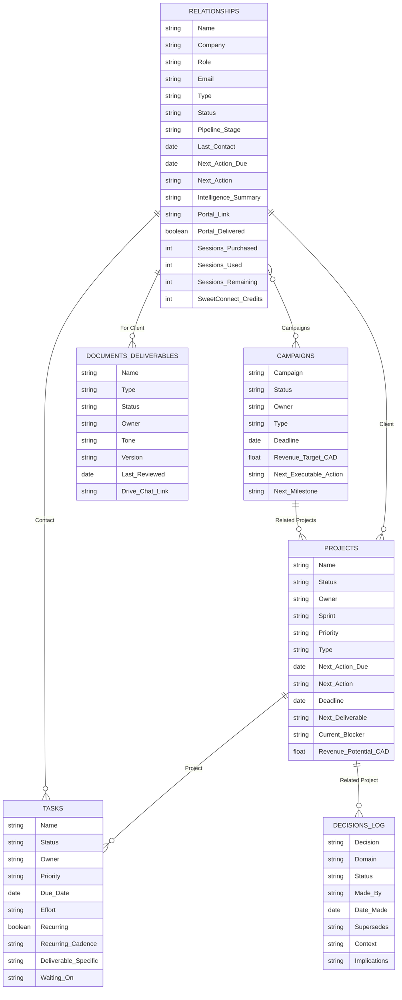

# Phase 2.10b: Make Projects + Tasks the operational hub (connections, owners, blockers)

## What's broken

You're right — the connections aren't visible. Today:

- **Project detail** is a generic field editor. It does not show the tasks under that project, who owns each one, what's blocking, or what's next.
- **Task detail** is a generic field editor. It does not show its parent project, sibling tasks, or the relationship it serves.
- **Relationship detail** has the new Funnel/Maturity panels but does **not** list the projects or tasks tied to that client.
- `tasks.waiting_on` and `tasks.dependencies` are free-text strings, not structured links — so "what's blocking what" can't be queried, rolled up, or visualized.
- No "My queue" / "Per-person workload" view. `owner` is a text enum, not a `profiles.id` FK, so we can't aggregate by real person.
- Kanban exists generically but there's no project-scoped board, no swimlanes by owner, no blocked-lane.

## What lands in 2.10b (no schema breakage, additive only)

### Migration 1 — Structured task connections

- `task_dependencies` table: `id, task_id, depends_on_task_id, kind ('blocks'|'related'), created_at, created_by`. Unique on (task_id, depends_on_task_id). Replaces the free-text `dependencies`/`waiting_on` for the connection graph; the text fields stay for narrative context.
- `tasks.assignee_id uuid` (FK→profiles, nullable). The `owner` text enum stays for legacy rows; new UI prefers `assignee_id`. Backfill rule: when assignee_id is set, it wins.
- `tasks.blocked` boolean generated column = `waiting_on IS NOT NULL OR EXISTS(unresolved blocker dep)`. Used to power the Blocked lane and counts.
- View `task_blockers` returning `(task_id, blocker_task_id, blocker_name, blocker_status)` for quick UI rendering.

### Migration 2 — Project ↔ Relationship clarity

- Add `projects.relationship_id uuid` (FK→relationships, nullable) as the canonical link. Keep `client_id` for back-compat; UI reads relationship_id first, falls back to client_id.
- View `project_rollup` returning `(project_id, total_tasks, open_tasks, blocked_tasks, overdue_tasks, next_due_date, owners[])` so the project list and detail can show real status without N+1 queries.

### Project detail page rewrite (`_app.projects.$id.tsx`)

Premium card layout, four panels:

1. **Overview card** — name, status, owner, deadline, revenue, linked relationship (clickable).
2. **Tasks board** — kanban scoped to this project, grouped by status, with a dedicated **Blocked** column. Each card shows assignee avatar, due date, and a red dot if overdue. Inline "Add task" creates with `project_id` prefilled.
3. **Blockers panel** — flat list of every blocked task in this project with the blocker task name + status. One-click "Mark unblocked" clears `waiting_on` and resolves the dep row.
4. **People panel** — grouped by `assignee_id` (or `owner` fallback) showing per-person open/blocked/overdue counts and their next due task.

### Task detail page rewrite (`_app.tasks.$id.tsx`)

- Header strip: parent project (clickable) · relationship (clickable) · assignee · due · status.
- **Blocks / Blocked-by** section: pickers to add either direction, rendered as chips with status color.
- **Dependencies graph** (lightweight): show 1-hop upstream and downstream tasks as a vertical list, no canvas required.
- Activity: existing fields collapsed into "Details" accordion so the page leads with state and connections, not a wall of inputs.

### Relationship detail additions (`_app.relationships.$id.tsx`)

Add two more panels under the existing four:
5. **Projects for this relationship** — list with status, next due, blocked count, "Open" link.
6. **Open tasks for this relationship** — flat list across all their projects, sortable by due/blocked.

### New global views

- `/_app/queue` already exists for proposals — add a sibling `/_app/my-tasks` route: a single-page view of every task assigned to the logged-in user, grouped by **Today / Overdue / Blocked / Upcoming / Waiting on others**. Becomes the daily start screen.
- `/_app/people` route: roster of assignees with workload counts (open · blocked · overdue · next due) — the "who's drowning, who's free" view.

### Kanban improvements (`kanban-board.tsx`)

- Add optional **swimlanes** prop (group rows into horizontal bands by a second field, e.g. assignee).
- Add a permanent **Blocked** column when the entity has the `blocked` field.
- Card footer shows: assignee chip · due date · blocker count.

### Sidebar

- Add "My tasks" and "People" under a new **Work** group above Pipeline.

## What I'm NOT doing in 2.10b

- Best-Practice Catalog (Step 2 of 2.10) — still next after this.
- Agents (Step 3) — after best practices.
- Notion sync (Step 4) — last.
- A full graph visualization with edges/nodes canvas. The 1-hop list view is enough for now; a full graph is 2.11+ if you want it.
- Renaming `owner` to `assignee` everywhere — additive only this pass to avoid breaking existing rows.

## Files touched

- 2 migrations under `supabase/migrations/`.
- New routes: `_app.my-tasks.tsx`, `_app.people.tsx`.
- Rewrites: `_app.projects.$id.tsx`, `_app.tasks.$id.tsx`.
- Edits: `_app.relationships.$id.tsx` (add 2 panels), `kanban-board.tsx` (swimlanes + blocked column), `entities.ts` (add assignee_id, relationship_id on projects, depends_on_task_ids virtual), `app-sidebar.tsx` (Work group).

## Memory writes

- `mem://features/work-graph` — task_dependencies semantics, blocked-column rule, swimlane convention.
- Append index Core: "Tasks have structured dependencies (task_dependencies). 'Blocked' is derived, never stored loose. Project detail = tasks board + blockers + people, not a field form."

## Suggested order after this

1. **2.10b (this plan)** — operational hub.
2. **2.10 Step 2** — Best-Practice Catalog.
3. **2.10 Step 3** — Agents (attachable to tasks/projects, runs feed Queue).
4. **2.10 Step 4** — Notion MCP push.

Approve and I'll build 2.10b end-to-end in one pass.  
  
<aside> 🧭

This ERD is the *core operational spine* (Work + People + Outputs + Decisions). It’s based on the live database schemas and the explicit relation properties that connect them.

</aside>

## Entities (databases)

- **Relationships** (people/companies you work with)
- **Projects** (units of work)
- **Tasks** (executable actions)
- **Campaigns** (multi-project initiatives)
- **Documents & Deliverables** (artifacts/outputs)
- **Decisions Log** (append-only canonical decisions)

---

## ERD (Mermaid)

---

## Relationship notes (what each edge means)

1. **Relationships → Projects (Client)**: a project can be scoped to a single client/contact record.
2. **Projects → Tasks (Project)**: tasks are the executable children of a project.
3. **Relationships → Tasks (Contact)**: tasks can also be attached directly to a contact (pipeline, follow-ups, etc.).
4. **Campaigns → Projects (Related Projects)**: campaigns group multiple projects under one initiative.
5. **Relationships ↔ Campaigns (Campaigns / Contacts)**: many-to-many so a campaign can target multiple contacts and a contact can be part of multiple campaigns.
6. **Relationships → Documents & Deliverables (For Client)**: documents/portals/contracts can be tied to a client.
7. **Projects → Decisions Log (Decisions / Related Project)**: decisions can be associated to a specific project to preserve rationale/constraints.

---

## Audit summary (core spine)

- The *graph is coherent* and already centered on a strong spine: **Relationships ⇄ (Projects/Tasks/Campaigns) ⇄ Outputs (Docs) + Governance (Decisions)**.
- You’ve correctly allowed **Tasks** to attach to *either* a **Project** (delivery) or a **Relationship** (pipeline), which is crucial for real operating behavior.
- Your relations are mostly one-hop navigable (good): from a contact you can traverse to their projects, tasks, campaigns, and documents.

## Gaps / candidates for “next ERD layer”

These are mentioned across the Command Centre but weren’t loaded as core databases in this pass:

- **Deliverable Catalog**, **Input Library**, **Workflow Library**, **QC Log**, **Sessions / Domain Assessments / Playbooks** (if they exist as databases, they’d become additional entities and edges).  
  
i thought this might help also